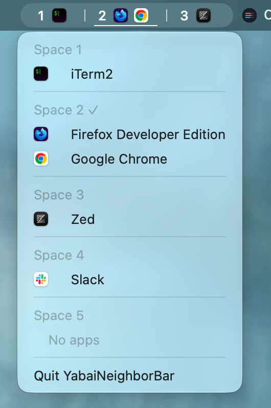

# Yabai Neighbor Bar

Native Swift/AppKit menu-bar agent showing up to three Spaces on the focused display, with one icon per app on each Space (multiple windows of one app share an icon). At either end, the selection fills the available slots from the other side. The current Space is underlined. Click the menu-bar item to see all Spaces on the focused display, activate an app, or quit.

## Requirements and installation

- macOS 13+, Xcode/Swift toolchain, yabai installed and running (no scripting addition or SIP changes required).
- `swift test` — unit tests; the optional read-only live smoke test skips if yabai returns malformed JSON or is unavailable.
- `sh scripts/build-app.sh` — builds `.build/YabaiNeighborBar.app` and ad-hoc signs the assembled bundle for local LaunchServices use. No Apple Developer ID signing/notarization is provided.
- `open .build/YabaiNeighborBar.app` — launch the app. It runs without a Dock icon (`LSUIElement`). To quit, select **Quit YabaiNeighborBar** from its menu. Avoid launching duplicate copies.

A menu-bar agent cannot guarantee visibility of all icons when the menu bar is crowded or has a notch. No launch-at-login configuration or yabairc changes are made. The app registers process-scoped yabai signals while running and removes them on normal exit.

## Refresh and diagnosis

The app queries `yabai -m query --displays`, `--spaces`, and `--windows` on launch, on yabai Space/display/window/app signals, every 30 seconds as a fallback, and on system wake. Signal registration is retried every 60 seconds after a yabai restart. Queries use direct argument arrays, a timeout, and do not overlap. If yabai is missing, stopped, or returns malformed data, the app replaces stale icons with `Yabai ⚠` and a tooltip explaining the failure; it retries automatically. Errors and recovery are recorded in macOS unified logs under subsystem `dev.local.YabaiNeighborBar`, category `refresh`. Example: `log show --last 10m --predicate 'subsystem == "dev.local.YabaiNeighborBar"'`.

A snapshot can change between yabai queries; the next refresh corrects transient mismatch. Very large numbers of windows may crowd the menu bar. The menu-bar image may become too wide to display fully when Spaces contain many apps.

## Verification limitations

Unit tests validate neighbor selection, duplicate windows, fallback icon resolution, deterministic item reconciliation, CLI timeouts, and refresh coalescing/recovery. On-machine visual checks still require a human: check order, current underline, app icons, multi-display behavior, and overflow. yabai on this machine has intermittently returned partial JSON (`[\n`) despite exit code 0; the app treats it as an error rather than showing stale data. The screenshot above illustrates one configuration, not every display or overflow case.
